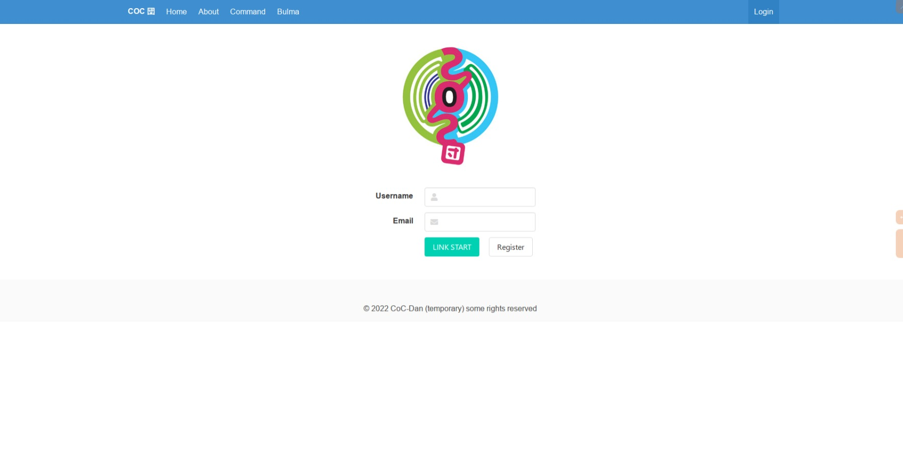
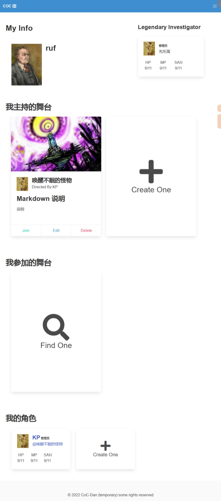
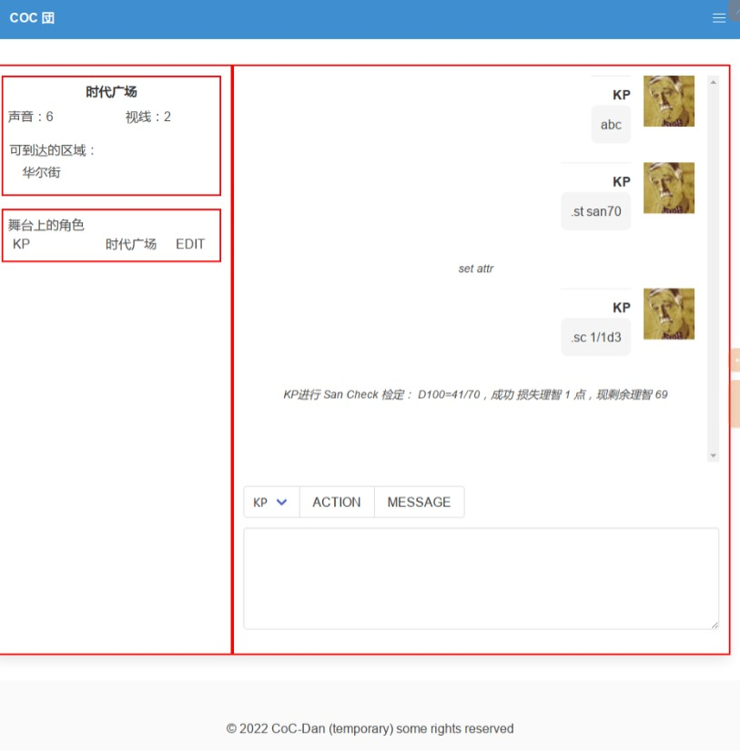

# cocdan

generated using Luminus version "4.30"

this is a online role-based chatting server/client for trgp (e.g. CoC), Currently under heavy development.

这是一个基于角色的 TRPG 在线聊天平台，当前正处于高强度开发状态。

Online Preview : [CoC-Dan](http://cocdan.ruffnex.me)

## Prerequisites

You will need [Leiningen][1] 2.0 or above installed.

[1]: https://github.com/technomancy/leiningen

## Running

To start a web server for the application, run:

    yarn build // generate app.js
    lein run migrate      // to create database for server
    lein run              // start server and watch

## Development

run:

Setup Environment:

    yarn                  // to fetch dependencies for client
    lein run migrate      // to create database for server

Start Development:

    shadow-cljs watch app // dynamic generate app.js
    lein run              // start server and watch
    
    or just use vscode:

    Install calva extension
    Ctrl Shift + P
    Select : Calva : Start a Project REPL 
    Select : cocdan Server + Client

## Preview

## Warning

## License

Copyright © 2022 CoC-Dan (temporary) some rights reserved
